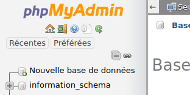
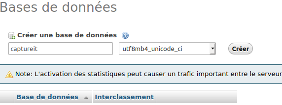

CaptureIT
=========

L’application CaptureIT est une application mobile open source qui permet de capturer, de collectionner et d’exploiter ses expériences d’apprentissage. Par expérience, nous désignons toute situation dans laquelle une personne a découvert, appris, compris ou démontré une notion, un savoir-faire, un savoir-être...

CaptureIT est développé sous Ubuntu 18.04 LTS.

# Prérequis

Ce projet a été développé sous environnement Linux (distribution Ubuntu 18.04 LTS). Il nécessite les ressources suivantes :

* Un éditeur de code compatible JavaScript (<a href="https://code.visualstudio.com/download"> VSCode pour notre part </a>).

# Installation serveur LAMP

L'application CaptureIT est est disponible sur github.

Sommaire : Installer GIT
* Installer GIT
* Cloner le dépôt

1. Installer GIT
<code>
<pre>
sudo apt-get install git
</pre>
</code>

2. Cloner le dépôt sur GitHub
<code>
<pre>
git clone https://github.com/kthezelais/CaptureIT.git
</pre>
</code>

# Installation serveur LAMP

Dans cette partie, nous nous référons à la documentation officiel pour installer un serveur LAMP, et avec les divers problèmes que nous avons pu rencontrer pendant la phase d'installation. Si vous rencontrez des problèmes qui sortent du cadre de ce projet, veuillez vous référer à la documentation officielle.

Sommaire :
* MySQL
* APACHE 2

Pour installer l'ensemble des dépendance du serveur LAMP, saisir la commande suivante dans un terminal :
<code>
<pre>
sudo apt install apache2 php libapache2-mod-php mysql-server php-mysql
</pre>
</code>

Il vous sera demandé plusieurs information de pré-configuration pour votre BDD MySQL. Suivez les étapes une à une jusqu'à arriver à la fin de l'installation.
Sélectionnez la configuration avec un serveur Apache2.

## <b>MySQL : Installation & Configuration</b>

Ici, nous allons configurer votre BDD MySQL en utilisant exclusivement l'utilisateur root. En production, il est peu recommandé d'utiliser le super utilisateur. A terme, nous créerons un utilisateur exclusif au service CaptureIT avec seulement les droits nécessaires au bon fonctionnement du service.

Sommaire :
* Se connecter à la BDD
* Utiliser la BDD MySQL
* Définir un mot de passe et des droits à l'utilisateur root
* Installer phpMyAdmin
* Configuration phpMyAdmin

1. Se connecter à la BDD

<code>
<pre>
mysql -u root
</pre>
</code>

2. Utiliser la BDD MySQL

<code>
<pre>
use mysql;
</pre>
</code>

3. Définir un mot de passe et des droits à l'utilisateur root

<code>
<pre>
ALTER USER 'root'@'localhost' IDENTIFIED WITH mysql_native_password BY '{# Mot de passe #}';
flush privileges;
quit
</pre>
</code>

4. Installer phpMyAdmin

<code>
<pre>
sudo apt install phpmyadmin
</pre>
</code>

5. Configuration phpMyAdmin

Connectez vous à l'adresse http://localhost/phpmyadmin. A cette étape il y trois possibilitées :
* Soit tout fonctionne est vous arrivé sur la page de connection de phpMyAdmin. Dans ce cas là, sautez cette étape (n°5).
* Soit vous avez une erreur 404 qui s'affiche sur votre navigateur. A ce moment là, utilisez la commande suivante pour réinstaller phpMyAdmin :
<code>
<pre>
sudo dpkg-reconfigure phpmyadmin
</pre>
</code>
* Soit vous avez une page blanche qui sans message qui s'affiche. Dans ce cas, saisissez les commandes qui suivent (votre ordinateur va redémarrer):
<code>
<pre>
sudo apt install php-mbstring php-gettext;
reboot
</pre>
</code>

A partir de là, vous devez pouvoir accéder à l'interface de phpMyAdmin. Si ce n'est pas le cas, vérifiez que votre serveur Apache2 est en fonction : une page doit s'afficher à l'adresse http://localhost/. Si ce n'est pas le cas, démarrez le service avec la commande suivante :
<code>
<pre>
sudo service apache2 restart
</pre>
</code>

Sinon, veuillez vous référez à la documentation officielle.

Pour vous connecter, saisissez les informations de l'utilisateur root (MySQL) que nous avions configuré à l'étape 3.

6. Créer une base de donné sur phpMyAdmin.

Une fois connecté à phpMyAdmin, créez une nouvelle base de données :  

Appelez la <b>captureit</b>, et choisissez l'interclassement <b>utf8mb4_unicode_ci</b> :  

Nous avons terminé avec la configuration de MySQL.

# TRAX-LRS : Installation & Configuration

Concernant TRAX-LRS, nous l'utilisons à partir du serveur de développement de manière à ce qu'il ne soit pas accessible à l'extérieur de votre réseau privé.

## <b>Composer : installation de TRAX LRS</b>

A la racine du projet, saisissez les commandes suivantes.

Sommaire :
* Installer composer & créer un projet TRAX-LRS
* Configurer TRAX-LRS et son fichier <b>.env</b>
* Configuration de la BDD captureit avec l'artisan Laravel
* Lancer le serveur TRAX-LRS en local
* Créer un utilisateur admin
* Créer un utilisateur TRAX-LRS pour générer des Captures

1. Installer composer & créer un projet TRAX-LRS
<code>
<pre>
sudo apt-get install composer;
composer create-project --prefer-dist --stability rc trax/lrs traxlrs
</pre>
</code>

2. Configurer TRAX-LRS et son fichier <b>.env</b>
Complétez le fichier <b>.env</b> dans le repertoire <b>traxlrs/</b> à la racine du projet par :
<code>
<pre>
APP_NAME="TRAX LRS"
APP_ENV=local
APP_KEY={# Conserver la valeur par défaut #}
APP_DEBUG=true
APP_URL=http://trax.test

DB_CONNECTION=mysql
DB_HOST=127.0.0.1
DB_PORT=3306
DB_DATABASE=captureit
DB_USERNAME={# User de votre base de données MYSQL #}
DB_PASSWORD={# Password de votre base de données MYSQL #}
DB_MARIADB=0

SESSION_DRIVER=database
SESSION_CONNECTION=mysql
SESSION_LIFETIME=120
</pre>
</code>

3. Configuration de la BDD captureit avec l'artisan Laravel
Saisir ensuite la commande suivante dans le dossier <b>traxlrs/</b> à la racine du projet (crée les éléments dans la base de données) :
<code>
<pre>
php artisan migrate
</pre>
</code>

4. Lancer le serveur TRAX-LRS en local

Pour exécuter le serveur en local, se placer dans le dossier trax-lrs et saisir la commande suivante :
<code>
<pre>
php artisan serve
</pre>
</code>

Aller ensuite à l'adresse suivante : http://127.0.0.1:8000.

Si vous souhaitez que votre TRAX-LRS soit accessible sur votre réseau local, saisissez la commande suivante :

<code>
<pre>
php artisan serve --host={# Adresse IP machine hôte #}
</pre>
</code>

5. Créer un utilisateur admin

TRAX-LRS est composé d'une interface web (GUI) permettant de gérer les accès à l'API. L'URL précédente permet d'accéder à cette page qui nécessite des droits d'accès particulier. Pour pouvoir générer un compte permettant de s'y connecter, saisissez la commande suivante :
<code>
<pre>
php artisan user:create-admin {# Saisir une adresse email valide #}
</pre>
</code>

Entrez ensuite l'email que vous avez saisi, et le mot de passé généré par le serveur sur l'interface de connexion TRAX-LRS.

Cette première interface vous permet donc de gérer les accès à votre API. Pour utiliser l'API TRAX-LRS (ce qui nous interesse ici), testez tout d'abord que celle-ci fonctionne en vous rendant sur cette adresse : http://127.0.0.1:8000/trax/ws/xapi/about

6. Créer un utilisateur TRAX-LRS pour générer des Captures

Cette étape vous permet de créer un utilisateur pour pouvoir communiquer avec TRAX-LRS, générer des statements (Capture) et les récupérer.

<code>
<pre>
php artisan client:create {# Pseudo #} {# Mot de passe #}
</pre>
</code>

Pour tester que TRAX-LRS fonctionne, connectez-vous à cette adresse : http://127.0.0.1:8000/trax/ws/xapi/about. Elle doit vous renvoyer un fichier au format JSON. Si ce n'est pas le cas, vérifiez que votre serveur TRAX-LRS est bien lancé, ou que vous êtes connecté à la bonne adresse.

A partir d'ici, vous n'avez plus qu'à transmettre des requêtes en respect avec le standard xAPI pour pouvoir communiquer avec votre serveur. Pour plus d'informations, rendez-vous sur ce dépôt officiel : https://github.com/adlnet/xAPI-Spec/blob/master/xAPI-Communication.md.

Pour plus d'information sur l'utilisation de TRAX-LRS, rendez-vous sur ce dépôt officiel : https://github.com/trax-project/trax-lrs.

# Apache2 : Problème requête CORS

CORS est un protocle implémenté dans les navigateurs web récent, et qui empêche par défaut d'effectuer des requêtes dites "cross-origin" (entre 2 domaines différent). Pour régler ce problème, il faut configurer le serveur Apache2 de manière a autoriser le cross-origin.
ATTENTION: pour le moment, nous allons autoriser toutes les origins extérieurs car nous sommes en phase de développement. A terme, nous limiterons l'accès uniquement aux domaines nécessaire au bon fonctionnement du service :

Ouvrir le fichier de configuration apache2.conf en superutilisateur, dans la balise "Directory /var/www/", ajouter la ligne suivante :
<code>
<pre>
Header set Access-Control-Allow-Origin "*"
</pre>
</code>

## Arborescence du projet

Ci-dessous, l'arborescence du projet CaptureIT. Ce projet étant en pleine phase de développement, il est composé de certain fichier qui ne sont plus utilisés. Ils sont conservés car ils peuvent potentiellement être réutilisés ultérieurement.

<pre>
├── ajax-example-request : dossier contenant les fichiers qui ne sont plus utilisés mais garde un intérêt de réutilisation.
|   |
│   ├── ajax-client : ancien frontend de CaptureIT qui contient les fichiers permettant d'interroger directement TRAX-LRS en AJAX.
|   |   |
│   │   ├── add_capture.html : fichier qui permet de créer une Capture dans TRAX-LRS.
|   |   |
│   │   ├── captureit-lib.js : fichier pensé initialement pour contenir l'ensemble des fonction javascript et requête AJAX (librairie CaptureIT incomplète).
|   |   |
│   │   ├── sha256.js : librairie importé permettant de chiffrer en sha256. Il est utilisé pour le chiffrement sha2 de l'image dans le statement d'une Capture.
|   |   |
│   │   ├── test_get_statement.html : permet de récupérer un statement (Capture) à partir de son ID.
|   |   |
│   │   └── test_get_statements.html : permet de récupérer tous les statements (Captures) stockés par TRAX-LRS.
|   |
|   ├── img : répertoire qui stock les images des Captures.
|   |
│   ├── JSON_CaptureIT.json : format JSON d'une Capture.
|   |
│   └── save_img.php : code PHP interrogé par le client "add_capture.html", et qui permet d'enregistrer l'image d'une capture. Renvoie le nom de l'image.
|
├── backend : dossier contenant la dernière version du backend (en cours de développement : non-fonctionnel).
|   |
│   ├── create_capture.php : futur script php permettant de créer une Capture.
|   |
│   ├── login.php : page permettant de se connecter au service. Elle demande le login/mdp d'un client TRAX-LRS pour se connecter.
|   |
│   ├── logout.php : page de déconnexion au service.
|   |
│   └── status.php : page qui renvoie le status de la session courante.
|
├── frontend : dossier contenant la dernière version du frontend (en cours de développement : non-fonctionnel).
|   |
│   ├── asset : dossier contenant tous les fichiers non-HTML.
|   |   |
│   │   └── js : dossier contenant tous les scripts JavaScript.
|   |       |
│   │       ├── connection.js : script JavaScript permettant de se connecter au service.
|   |       |
│   │       ├── index.js : script de la page d'accueil accessible une fois connecté au service.
|   |       |
│   │       └── lib : contient les librairies importées dans le projet.
|   |           |
│   │           ├── jquery.min.js
|   |           |
│   │           └── sha256.js
│   │
│   ├── connection.html : page HTML proposant une interface sommaire pour se connecter au service.
│   │
│   ├── create_capture.html : page HTML proposant une interface sommaire pour créer une capture (non implémenté).
│   │
│   ├── display_capture.html : page HTML proposant une interface sommaire pour afficher une capture à partir d'un ID de statement (non implémenté). 
│   │
│   └── index.html : page HTML proposant une interface sommaire pour afficher l'ensemble des capture sous forme de "publication" ou "file d'actualité" (non implémenté).
│
├── img-readme : dossier contenant les images et document utilisé par le README.md.
│   │
│   ├── creer-bdd.png
│   │
│   └── nommer_bdd.png
|
├── LICENSE : licence du projet.
|
└── README.md
</pre>

# Licence

Ce projet est <strong>Open-Source</strong>, et sous licence BSD-2-clause. Pour en savoir plus, se référer à la <b>LICENCE</b>.